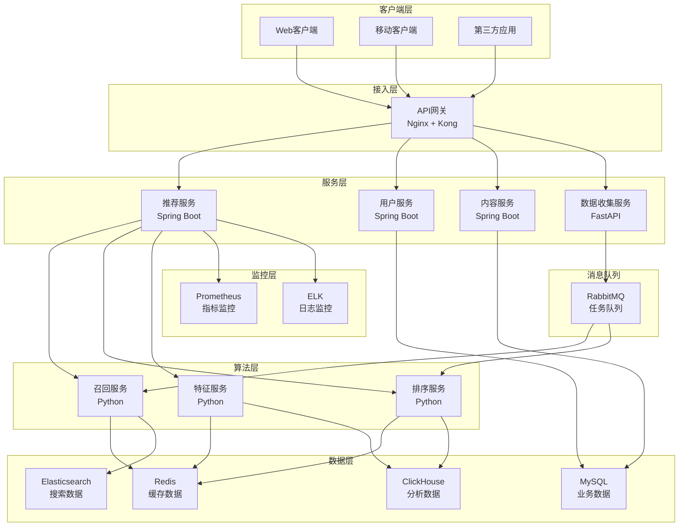
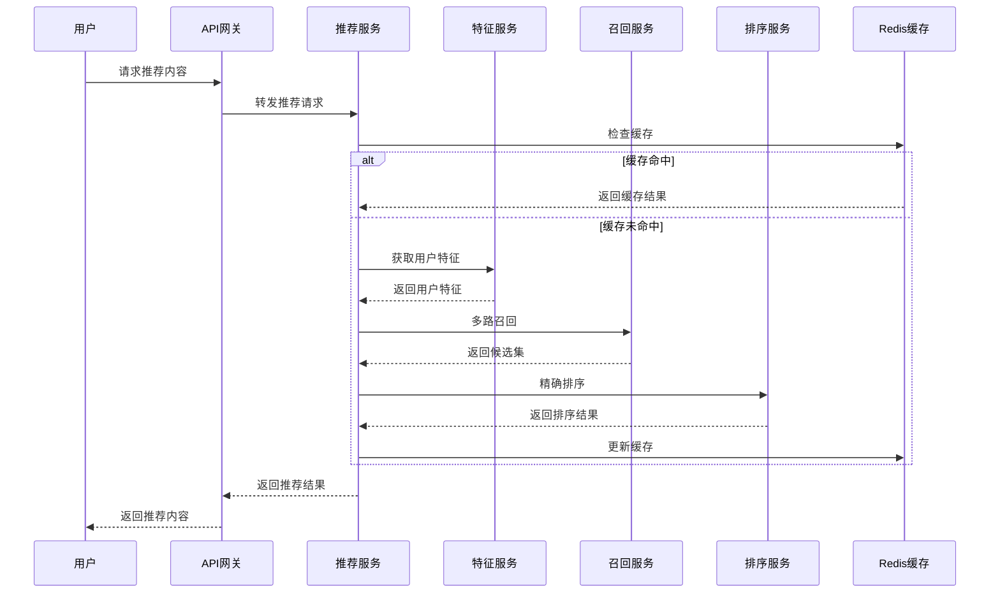
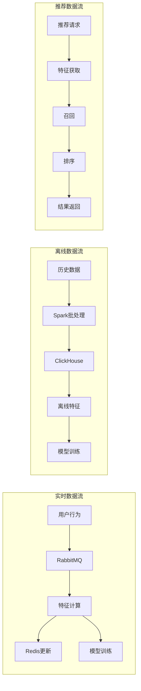

# 智能内容推荐平台设计文档

## 概述

智能内容推荐平台采用微服务架构，通过分层推荐策略为用户提供个性化内容推荐。系统支持文章、视频、商品等多种内容类型，具备实时推荐、用户画像构建、效果监控等核心功能。

### 设计目标

- **高性能**: 推荐响应时间 < 500ms，支持 10000+ QPS
- **高可用**: 系统可用性 > 99.9%，支持降级和容错
- **可扩展**: 支持水平扩展，模块化设计便于功能扩展
- **智能化**: 多算法融合，持续学习优化推荐效果

## 架构

### 整体架构



### 推荐流程架构



## 组件和接口

### 1. API网关

**职责**: 请求路由、负载均衡、限流、认证授权

**技术栈**: Nginx + Kong

**核心功能**:
- 请求路由和负载均衡
- API限流和熔断
- 用户认证和权限控制
- 请求日志和监控

### 2. 推荐服务

**职责**: 推荐请求处理、结果聚合、缓存管理

**技术栈**: Spring Boot + Redis

**核心接口**:
```java
@RestController
@RequestMapping("/api/v1/recommend")
public class RecommendController {
    
    @GetMapping("/content")
    public ResponseEntity<RecommendResponse> recommendContent(
        @RequestParam String userId,
        @RequestParam(defaultValue = "10") Integer size,
        @RequestParam(defaultValue = "mixed") String contentType
    );
    
    @PostMapping("/feedback")
    public ResponseEntity<Void> recordFeedback(
        @RequestBody FeedbackRequest request
    );
}
```

### 3. 特征服务

**职责**: 用户特征和内容特征的提取、存储、更新

**技术栈**: Python + FastAPI + Redis + ClickHouse + RabbitMQ

**核心接口**:
```python
@app.get("/api/v1/features/user/{user_id}")
async def get_user_features(user_id: str) -> UserFeatures:
    """获取用户实时特征"""
    pass

@app.get("/api/v1/features/content/{content_id}")
async def get_content_features(content_id: str) -> ContentFeatures:
    """获取内容特征"""
    pass

@app.post("/api/v1/features/update")
async def update_features(update_request: FeatureUpdateRequest):
    """批量更新特征"""
    pass
```

### 4. 召回服务

**职责**: 多路召回策略、候选集生成

**技术栈**: Python + Elasticsearch + Redis

**召回策略**:
- **协同过滤召回**: 基于用户行为相似性
- **内容召回**: 基于内容相似度和标签匹配
- **热门召回**: 基于内容热度和趋势
- **用户历史召回**: 基于用户历史偏好

### 5. 排序服务

**职责**: 候选集精确排序、多样性保证

**技术栈**: Python + TensorFlow/PyTorch

**排序模型**:
- **Wide&Deep模型**: 结合记忆和泛化能力
- **DeepFM模型**: 自动特征交叉
- **多任务学习**: 同时优化点击率和转化率

## 数据模型

### 数据库设计

#### MySQL - 业务数据

```sql
-- 用户表
CREATE TABLE users (
    id BIGINT PRIMARY KEY AUTO_INCREMENT,
    username VARCHAR(50) UNIQUE NOT NULL,
    email VARCHAR(100) UNIQUE,
    phone VARCHAR(20),
    profile_data JSON,
    created_at TIMESTAMP DEFAULT CURRENT_TIMESTAMP,
    updated_at TIMESTAMP DEFAULT CURRENT_TIMESTAMP ON UPDATE CURRENT_TIMESTAMP
);

-- 内容表
CREATE TABLE contents (
    id BIGINT PRIMARY KEY AUTO_INCREMENT,
    title VARCHAR(200) NOT NULL,
    content_type ENUM('article', 'video', 'product') NOT NULL,
    content_data JSON NOT NULL,
    tags JSON,
    category_id INT,
    author_id BIGINT,
    status ENUM('draft', 'published', 'archived') DEFAULT 'draft',
    publish_time TIMESTAMP,
    created_at TIMESTAMP DEFAULT CURRENT_TIMESTAMP,
    updated_at TIMESTAMP DEFAULT CURRENT_TIMESTAMP ON UPDATE CURRENT_TIMESTAMP,
    INDEX idx_type_status (content_type, status),
    INDEX idx_category (category_id),
    INDEX idx_author (author_id)
);

-- 分类表
CREATE TABLE categories (
    id INT PRIMARY KEY AUTO_INCREMENT,
    name VARCHAR(50) NOT NULL,
    parent_id INT DEFAULT 0,
    level TINYINT DEFAULT 1,
    sort_order INT DEFAULT 0
);
```

#### Redis - 缓存数据结构

```
# 用户特征缓存
user:features:{user_id} -> Hash
{
    "age_group": "25-34",
    "interests": "tech,sports,travel",
    "behavior_score": "0.85",
    "last_active": "1640995200"
}

# 推荐结果缓存
recommend:result:{user_id}:{content_type} -> List
[content_id1, content_id2, content_id3, ...]

# 内容热度缓存
content:hot:{content_type} -> ZSet
{content_id: hot_score}

# 用户实时行为
user:behavior:{user_id} -> List
[{action, content_id, timestamp}, ...]
```

#### Elasticsearch - 搜索索引

```json
{
  "mappings": {
    "properties": {
      "content_id": {"type": "keyword"},
      "title": {
        "type": "text",
        "analyzer": "ik_max_word",
        "search_analyzer": "ik_smart"
      },
      "content_type": {"type": "keyword"},
      "tags": {"type": "keyword"},
      "category": {"type": "keyword"},
      "embedding": {
        "type": "dense_vector",
        "dims": 128
      },
      "publish_time": {"type": "date"},
      "hot_score": {"type": "float"}
    }
  }
}
```

#### ClickHouse - 行为数据

```sql
CREATE TABLE user_behaviors (
    user_id UInt64,
    content_id UInt64,
    action_type String,
    content_type String,
    session_id String,
    device_type String,
    timestamp DateTime,
    duration UInt32,
    extra_data String
) ENGINE = MergeTree()
PARTITION BY toYYYYMM(timestamp)
ORDER BY (user_id, timestamp);
```

### 数据流设计



## 错误处理

### 1. 服务降级策略

```java
@Component
public class RecommendFallbackHandler {
    
    @HystrixCommand(fallbackMethod = "getDefaultRecommendations")
    public List<Content> getPersonalizedRecommendations(String userId) {
        // 个性化推荐逻辑
    }
    
    public List<Content> getDefaultRecommendations(String userId) {
        // 返回热门内容作为降级方案
        return hotContentService.getHotContents();
    }
}
```

### 2. 缓存容错机制

- **多级缓存**: 本地缓存 -> Redis -> 数据库
- **缓存预热**: 系统启动时预加载热门数据
- **缓存更新**: 异步更新，避免缓存雪崩

### 3. 数据一致性保证

- **最终一致性**: 用户行为数据允许短暂不一致
- **强一致性**: 用户基础信息和内容数据保证强一致
- **补偿机制**: 数据同步失败时的重试和补偿

### 4. 监控和告警

```yaml
# Prometheus告警规则
groups:
- name: recommendation.rules
  rules:
  - alert: HighResponseTime
    expr: histogram_quantile(0.95, rate(http_request_duration_seconds_bucket[5m])) > 0.5
    for: 2m
    labels:
      severity: warning
    annotations:
      summary: "推荐服务响应时间过高"
      
  - alert: LowCacheHitRate
    expr: rate(cache_hits_total[5m]) / rate(cache_requests_total[5m]) < 0.8
    for: 5m
    labels:
      severity: warning
    annotations:
      summary: "缓存命中率过低"
```

## 测试策略

### 1. 单元测试

- **服务层测试**: 使用JUnit和Mockito测试业务逻辑
- **算法测试**: 使用pytest测试推荐算法的准确性
- **数据层测试**: 使用TestContainers测试数据库操作

### 2. 集成测试

- **API测试**: 使用Postman/Newman测试接口功能
- **端到端测试**: 使用Selenium测试完整推荐流程
- **性能测试**: 使用JMeter测试系统性能指标

### 3. A/B测试框架

```java
@Service
public class ABTestService {
    
    public String getExperimentGroup(String userId, String experimentName) {
        // 基于用户ID和实验名称分配实验组
        int hash = (userId + experimentName).hashCode();
        return Math.abs(hash) % 100 < 50 ? "control" : "treatment";
    }
    
    public void recordExperimentMetric(String userId, String experimentName, 
                                     String group, String metric, double value) {
        // 记录实验指标
    }
}
```

### 4. 推荐效果评估

- **离线评估**: 使用历史数据评估算法效果
  - 准确率(Precision)、召回率(Recall)
  - NDCG、AUC等排序指标
  
- **在线评估**: 使用实时数据评估推荐效果
  - 点击率(CTR)、转化率(CVR)
  - 用户停留时间、跳出率

### 5. 压力测试

```bash
# JMeter压力测试脚本
jmeter -n -t recommendation_load_test.jmx \
       -l results.jtl \
       -e -o report \
       -Jusers=1000 \
       -Jramp_time=60 \
       -Jduration=300
```

**测试目标**:
- 10000 QPS下系统稳定运行
- 95%请求响应时间 < 500ms
- 系统资源使用率 < 80%