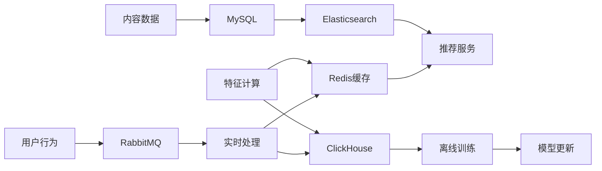

# 智能内容推荐平台系统架构文档

## 1. 系统概述

智能内容推荐平台是一个高性能、高可用的分布式推荐系统，采用微服务架构设计，支持文章、视频、商品等多种内容类型的个性化推荐。

### 1.1 设计目标

- **高性能**: 推荐响应时间 < 500ms，支持 10000+ QPS
- **高可用**: 系统可用性 > 99.9%，支持降级和容错
- **可扩展**: 支持水平扩展，模块化设计便于功能扩展
- **智能化**: 多算法融合，持续学习优化推荐效果

### 1.2 技术栈

| 层级 | 技术选型 |
|------|----------|
| 接入层 | Nginx, Kong |
| 服务层 | Spring Boot, FastAPI |
| 算法层 | Python, TensorFlow, PyTorch |
| 数据层 | MySQL, Redis, Elasticsearch, ClickHouse |
| 消息队列 | RabbitMQ |
| 监控 | Prometheus, Grafana, ELK |
| 容器化 | Docker, Kubernetes |

## 2. 整体架构

```
┌─────────────────────────────────────────────────────────────┐
│                        客户端层                              │
│  ┌─────────────┐  ┌─────────────┐  ┌─────────────┐        │
│  │  Web客户端   │  │  移动客户端  │  │  第三方应用  │        │
│  └─────────────┘  └─────────────┘  └─────────────┘        │
└─────────────────────────────────────────────────────────────┘
                              │
┌─────────────────────────────────────────────────────────────┐
│                        接入层                                │
│              ┌─────────────────────────────┐                │
│              │      API网关 (Nginx+Kong)    │                │
│              │  - 负载均衡  - 限流熔断      │                │
│              │  - 认证授权  - 监控日志      │                │
│              └─────────────────────────────┘                │
└─────────────────────────────────────────────────────────────┘
                              │
┌─────────────────────────────────────────────────────────────┐
│                        服务层                                │
│  ┌─────────────┐  ┌─────────────┐  ┌─────────────┐        │
│  │   推荐服务   │  │   用户服务   │  │   内容服务   │        │
│  │ Spring Boot │  │ Spring Boot │  │ Spring Boot │        │
│  └─────────────┘  └─────────────┘  └─────────────┘        │
│                    ┌─────────────┐                         │
│                    │ 数据收集服务 │                         │
│                    │   FastAPI   │                         │
│                    └─────────────┘                         │
└─────────────────────────────────────────────────────────────┘
                              │
┌─────────────────────────────────────────────────────────────┐
│                        算法层                                │
│  ┌─────────────┐  ┌─────────────┐  ┌─────────────┐        │
│  │   召回服务   │  │   排序服务   │  │   特征服务   │        │
│  │   Python    │  │   Python    │  │   Python    │        │
│  └─────────────┘  └─────────────┘  └─────────────┘        │
└─────────────────────────────────────────────────────────────┘
                              │
┌─────────────────────────────────────────────────────────────┐
│                        数据层                                │
│  ┌─────────────┐  ┌─────────────┐  ┌─────────────┐        │
│  │    MySQL    │  │    Redis    │  │Elasticsearch│        │
│  │   业务数据   │  │   缓存数据   │  │   搜索数据   │        │
│  └─────────────┘  └─────────────┘  └─────────────┘        │
│                    ┌─────────────┐                         │
│                    │ ClickHouse  │                         │
│                    │   分析数据   │                         │
│                    └─────────────┘                         │
└─────────────────────────────────────────────────────────────┘
```

## 3. 核心服务详解

### 3.1 推荐服务 (Recommendation Service)

**职责**: 推荐请求处理、结果聚合、缓存管理

**核心功能**:
- 接收推荐请求并进行参数验证
- 调用特征服务获取用户和内容特征
- 协调召回和排序服务生成推荐结果
- 管理多级缓存策略
- 实现降级和容错机制

**技术实现**:
```java
@Service
public class RecommendationService {
    
    @Autowired
    private FeatureService featureService;
    
    @Autowired
    private RecallService recallService;
    
    @Autowired
    private RankingService rankingService;
    
    @Cacheable(value = "recommendations", key = "#userId + '_' + #contentType")
    public List<RecommendationItem> getRecommendations(String userId, String contentType, int size) {
        // 1. 获取用户特征
        UserFeatures userFeatures = featureService.getUserFeatures(userId);
        
        // 2. 多路召回
        List<ContentItem> candidates = recallService.recall(userFeatures, contentType, size * 3);
        
        // 3. 精确排序
        List<RecommendationItem> results = rankingService.rank(candidates, userFeatures, size);
        
        return results;
    }
}
```

### 3.2 特征服务 (Feature Service)

**职责**: 特征提取、存储、实时更新

**核心功能**:
- 用户实时特征计算和存储
- 内容特征提取和向量化
- 特征工程和数据预处理
- 特征缓存和持久化

**数据流**:
```
用户行为 → RabbitMQ → 特征计算 → Redis缓存 → ClickHouse存储
```

### 3.3 召回服务 (Recall Service)

**职责**: 多路召回策略、候选集生成

**召回策略**:
1. **协同过滤召回**: 基于用户-物品交互矩阵
2. **内容召回**: 基于内容相似度和标签匹配
3. **热门召回**: 基于内容热度和趋势
4. **用户历史召回**: 基于用户历史偏好

**算法实现**:
```python
class RecallService:
    def __init__(self):
        self.cf_model = CollaborativeFilteringModel()
        self.content_model = ContentBasedModel()
        self.hot_model = HotContentModel()
    
    def recall(self, user_features, content_type, size):
        # 多路召回
        cf_candidates = self.cf_model.recall(user_features, size // 3)
        content_candidates = self.content_model.recall(user_features, size // 3)
        hot_candidates = self.hot_model.recall(content_type, size // 3)
        
        # 候选集合并和去重
        candidates = self.merge_and_deduplicate([
            cf_candidates, content_candidates, hot_candidates
        ])
        
        return candidates[:size]
```

### 3.4 排序服务 (Ranking Service)

**职责**: 候选集精确排序、多样性保证

**模型架构**:
- **Wide&Deep模型**: 结合记忆和泛化能力
- **DeepFM模型**: 自动特征交叉
- **多任务学习**: 同时优化点击率和转化率

## 4. 数据架构

### 4.1 数据分层

```
┌─────────────────────────────────────────────────────────────┐
│                      应用层数据                              │
│  ┌─────────────┐  ┌─────────────┐  ┌─────────────┐        │
│  │  推荐结果    │  │  用户画像    │  │  内容特征    │        │
│  └─────────────┘  └─────────────┘  └─────────────┘        │
└─────────────────────────────────────────────────────────────┘
                              │
┌─────────────────────────────────────────────────────────────┐
│                      服务层数据                              │
│  ┌─────────────┐  ┌─────────────┐  ┌─────────────┐        │
│  │  业务数据    │  │  缓存数据    │  │  搜索数据    │        │
│  │   MySQL     │  │   Redis     │  │Elasticsearch│        │
│  └─────────────┘  └─────────────┘  └─────────────┘        │
└─────────────────────────────────────────────────────────────┘
                              │
┌─────────────────────────────────────────────────────────────┐
│                      存储层数据                              │
│  ┌─────────────┐  ┌─────────────┐  ┌─────────────┐        │
│  │  行为数据    │  │  日志数据    │  │  模型数据    │        │
│  │ ClickHouse  │  │    ELK      │  │   HDFS      │        │
│  └─────────────┘  └─────────────┘  └─────────────┘        │
└─────────────────────────────────────────────────────────────┘
```

### 4.2 数据流转



## 5. 部署架构

### 5.1 容器化部署

```yaml
# docker-compose.yml
version: '3.8'
services:
  nginx:
    image: nginx:alpine
    ports:
      - "80:80"
      - "443:443"
    
  recommendation-service:
    image: recommendation-service:latest
    replicas: 3
    
  user-service:
    image: user-service:latest
    replicas: 2
    
  content-service:
    image: content-service:latest
    replicas: 2
    
  mysql:
    image: mysql:8.0
    environment:
      MYSQL_ROOT_PASSWORD: password
    
  redis:
    image: redis:alpine
    
  elasticsearch:
    image: elasticsearch:7.17.0
```

### 5.2 Kubernetes部署

```yaml
# k8s-deployment.yaml
apiVersion: apps/v1
kind: Deployment
metadata:
  name: recommendation-service
spec:
  replicas: 3
  selector:
    matchLabels:
      app: recommendation-service
  template:
    metadata:
      labels:
        app: recommendation-service
    spec:
      containers:
      - name: recommendation-service
        image: recommendation-service:latest
        ports:
        - containerPort: 8080
        resources:
          requests:
            memory: "512Mi"
            cpu: "500m"
          limits:
            memory: "1Gi"
            cpu: "1000m"
```

## 6. 监控和运维

### 6.1 监控指标

**业务指标**:
- 推荐点击率 (CTR)
- 推荐转化率 (CVR)
- 用户停留时间
- 推荐覆盖率

**技术指标**:
- 接口响应时间
- 系统QPS
- 错误率
- 缓存命中率

### 6.2 告警策略

```yaml
# prometheus-alerts.yml
groups:
- name: recommendation.rules
  rules:
  - alert: HighResponseTime
    expr: histogram_quantile(0.95, rate(http_request_duration_seconds_bucket[5m])) > 0.5
    for: 2m
    labels:
      severity: warning
    annotations:
      summary: "推荐服务响应时间过高"
      
  - alert: LowCacheHitRate
    expr: rate(cache_hits_total[5m]) / rate(cache_requests_total[5m]) < 0.8
    for: 5m
    labels:
      severity: warning
    annotations:
      summary: "缓存命中率过低"
```

## 7. 安全架构

### 7.1 认证授权

- **JWT Token**: 用户身份认证
- **OAuth 2.0**: 第三方应用授权
- **API Key**: 服务间调用认证

### 7.2 数据安全

- **数据加密**: 敏感数据AES加密存储
- **传输加密**: HTTPS/TLS加密传输
- **访问控制**: 基于角色的权限控制

### 7.3 安全防护

- **DDoS防护**: 基于Nginx的限流和防护
- **SQL注入防护**: 参数化查询和输入验证
- **XSS防护**: 输出编码和CSP策略

## 8. 性能优化

### 8.1 缓存策略

- **多级缓存**: 本地缓存 + Redis + CDN
- **缓存预热**: 热门数据预加载
- **缓存更新**: 异步更新策略

### 8.2 数据库优化

- **读写分离**: 主从复制分离读写
- **分库分表**: 按用户ID水平分片
- **索引优化**: 合理设计索引策略

### 8.3 算法优化

- **模型压缩**: 模型量化和剪枝
- **并行计算**: GPU加速和分布式计算
- **增量更新**: 增量学习和在线更新

## 9. 扩展性设计

### 9.1 水平扩展

- **无状态服务**: 服务无状态化设计
- **负载均衡**: 基于一致性哈希的负载均衡
- **自动扩缩容**: 基于CPU和内存的自动扩缩容

### 9.2 功能扩展

- **插件化架构**: 算法插件化设计
- **配置化**: 业务规则配置化
- **多租户**: 支持多租户隔离

## 10. 容灾备份

### 10.1 数据备份

- **定期备份**: 数据库定期全量备份
- **增量备份**: 日志增量备份
- **异地备份**: 跨地域数据备份

### 10.2 故障恢复

- **主从切换**: 数据库主从自动切换
- **服务降级**: 多级降级策略
- **快速恢复**: 基于容器的快速恢复